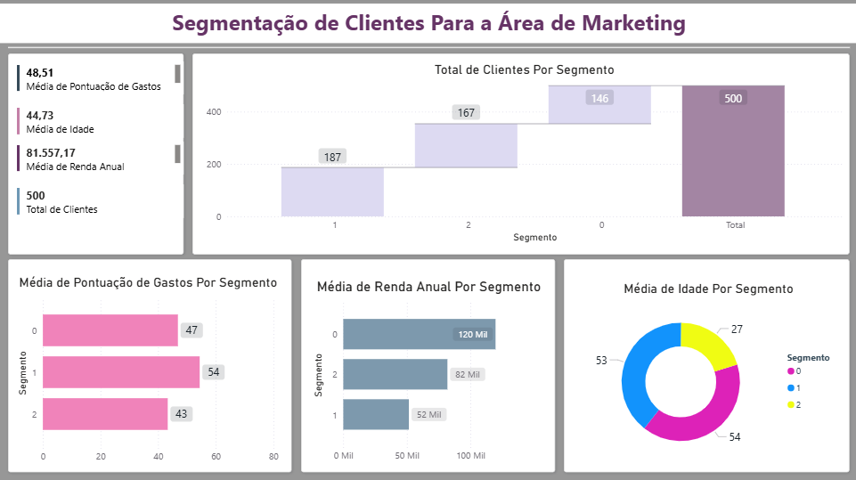

# 🎯 Segmentação de Clientes com Machine Learning e Power BI


## 📋 Sobre o Projeto

Projeto de **Data Science** para segmentação de clientes utilizando algoritmo K-Means e visualização com Power BI. Desenvolvido como solução do **Lab 7 da Data Science Academy**.

### 🎯 Objetivo de Negócio
Segmentar 500 clientes em 3 grupos baseados em idade, renda e comportamento de gastos para fornecer insights estratégicos para a equipe de Marketing.

## 📁 Estrutura do Projeto

```
segmentacao_clientes_ml_pwbi/
├── data/
│   ├── dados_clientes.csv        # Dataset original
│   └── segmentos.csv             # Dataset com clusters
├── notebooks/
│   └── segmentacao_clientes.ipynb # Notebook principal
├── requirements.txt               # Dependências
├── README.md                      # Esta documentação
└── .gitignore                     # Arquivos ignorados
```

## 🚀 Como Executar

### Pré-requisitos
- Python 3.9+
- Jupyter Notebook
- Conta Power BI (Empresarial ou Estudante para integração completa)

### Instalação

1. **Clone o repositório**
```bash
git clone https://github.com/surocham/segmentacao_clientes_ml_pwbi.git
cd segmentacao_clientes_ml_pwbi
```

2. **Crie e ative ambiente virtual**
```bash
python -m venv venv
# Windows:
venv\Scripts\activate
# Linux/Mac:
source venv/bin/activate
```

3. **Instale dependências**
```bash
pip install -r requirements.txt
```

### 📦 Dependências

```txt
pandas==1.5.3
scikit-learn==1.3.0
numpy==1.24.3
jupyter==1.0.0
notebook==6.5.4
powerbiclient==0.1.3
matplotlib==3.7.1
seaborn==0.12.2
```

## 📊 Dataset

### Características dos Dados
- **500 clientes** no total
- **3 variáveis** para segmentação:
  - `idade`: 18-70 anos
  - `renda_anual`: $20,384 - $149,695
  - `pontuacao_gastos`: 0-100 pontos

### Estatísticas Descritivas
| Métrica | Idade | Renda Anual | Pontuação Gastos |
|---------|-------|-------------|------------------|
| Média | 44.73 | $81,557.17 | 48.51 |
| Desvio Padrão | 15.24 | $36,764.38 | 29.56 |
| Mínimo | 18 | $20,384 | 0 |
| Máximo | 70 | $149,695 | 100 |

## 🔧 Implementação

### 1. Pré-processamento
```python
from sklearn.preprocessing import StandardScaler

padronizador = StandardScaler()
dados_padronizados = padronizador.fit_transform(
    df_dsa[['idade', 'renda_anual', 'pontuacao_gastos']]
)
```

### 2. Modelagem K-Means
```python
from sklearn.cluster import KMeans

k = 3
kmeans = KMeans(n_clusters=k)
kmeans.fit(dados_padronizados)

# Atribuir clusters
df_dsa['cluster'] = kmeans.labels_
```

### 3. Exportar Resultados
```python
df_dsa.to_csv('data/segmentos.csv', index=False)
```

### 4. Integração Power BI
```python
from powerbiclient import QuickVisualize, get_dataset_config
from powerbiclient.authentication import DeviceCodeLoginAuthentication

# Autenticação
device_auth = DeviceCodeLoginAuthentication()

# Gerar dashboard
relatorio_PBI = QuickVisualize(get_dataset_config(df_dsa), auth=device_auth)
relatorio_PBI
```

## 📈 Resultados

### Distribuição dos Segmentos
- **Segmento 0**: 167 clientes (33.4%)
- **Segmento 1**: 146 clientes (29.2%)
- **Segmento 2**: 187 clientes (37.4%)

### Perfis Identificados

#### 🟢 Segmento 0 - Jovens Moderados
- **Idade média**: 27 anos
- **Renda anual**: $42,510
- **Pontuação gastos**: 47
- **Característica**: Clientes jovens com renda moderada

#### 🔵 Segmento 1 - Maduros Conscientes
- **Idade média**: 53 anos
- **Pontuação gastos**: 54
- **Característica**: Clientes maduros com gastos equilibrados

#### 🟣 Segmento 2 - Maduros Premium
- **Idade média**: 54 anos
- **Renda anual**: ~$83,000
- **Pontuação gastos**: 43
- **Característica**: Clientes maduros com alta renda

## 🎨 Dashboard Power BI

### Visualizações Incluídas
1. **Cards de KPI**:
   - Total de Clientes: 500
   - Média de Idade: 44.73
   - Média de Renda: $81,557.17
   - Média de Pontuação: 48.51

2. **Gráficos de Barra**:
   - Média de Pontuação por Segmento
   - Média de Renda por Segmento
   - Média de Idade por Segmento
   - Total de Clientes por Segmento

## 💡 Insights para Marketing

### Estratégias por Segmento

| Segmento | Foco | Ações Recomendadas |
|----------|------|-------------------|
| **Segmento 0** | Atração | - Campanhas redes sociais<br>- Ofertas jovens<br>- Parcerias universitárias |
| **Segmento 1** | Fidelização | - Programas de pontos<br>- Email marketing<br>- Descontos aniversário |
| **Segmento 2** | Premium | - Produtos exclusivos<br>- Atendimento personalizado<br>- Eventos VIP |

## 📊 Métricas de Avaliação

### Business Impact Esperado
- **Aumento na conversão**: 20-30%
- **Redução no churn**: 15-20%
- **ROI de campanhas**: +25%
- **Satisfação do cliente**: +15%





## 📧 Contato

**Autor**: Suami Medeiros  
**Email**: suamirochati@gmail.com

[**LinkedIn**](https://www.linkedin.com/in/surocham/)
